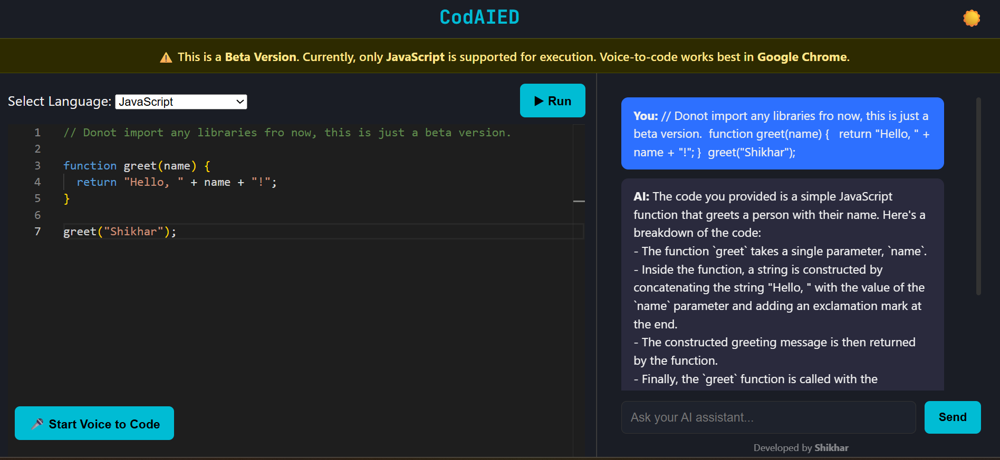

# ⚡ CodAIED – AI-Powered Code Editor



**CodAIED** is a modern AI-powered code editor that lets you:
- 👨‍💻 Write code in multiple languages with syntax highlighting (Monaco Editor)
- 🎤 Convert voice commands into code (Voice-to-Code via Cohere AI)
- 💬 Use an AI assistant panel to explain or fix your code
- 🌗 Toggle between light and dark themes
- 🚀 Execute JavaScript code right inside the editor

> 🧪 **Note:** This is a **Beta Version** — only JavaScript execution is supported. Voice-to-Code works best in **Google Chrome**.

---

## 🌐 Live Demo

👉 [Visit Live App on GitHub Pages](https://pandeyshikhar18.github.io/codedai-aicodeeditor/)

---

## ✨ Features

- 🎙 **Voice to Code** using Cohere AI
- 🧠 **AI Assistant Chat** to explain or refactor code
- 🛠 **Monaco Editor** with syntax highlighting
- 🌙 **Theme Toggle** (Light/Dark)
- ▶️ **Run Button** (only supports JavaScript)
- 🧭 **Drag & Drop Voice Button** (can be moved freely)
- 📦 Deployed with **GitHub Pages** (Vite-powered build)

---

## 📸 Screenshot

> Make sure your `public/screenshot.png` exists (or replace with your actual screenshot path)


---

## 🧑‍💻 Tech Stack

- React + TypeScript
- Vite
- Monaco Editor
- Cohere AI (Command R+ model)
- GitHub Pages
- Voice Recognition API (Browser)

---

## 🛠 Installation

```bash
git clone https://github.com/pandeyshikhar18/codedai-aicodeeditor.git
cd codedai-aicodeeditor
npm install
npm run dev
🚀 Deploy to GitHub Pages
Make sure your vite.config.ts includes:

ts
Copy
Edit
export default defineConfig({
  base: '/codedai-aicodeeditor/',
  plugins: [react()],
});
And your package.json has:

json
Copy
Edit
"homepage": "https://pandeyshikhar18.github.io/codedai-aicodeeditor",
"scripts": {
  "predeploy": "vite build",
  "deploy": "gh-pages -d dist"
}
Then deploy with:

bash
Copy
Edit
npm run deploy
🔐 API Key Info
This project uses Cohere AI for code generation and explanation. For development purposes, the API key is used client-side. You may rotate/regenerate it periodically or use a proxy in production.

📜 License
This project is open-source and available under the MIT License.

🙋‍♂️ Author
Made with ❤️ by Shikhar Pandey
