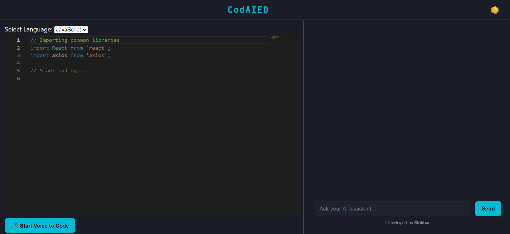

# CodAIED 🧠💻

**CodAIED** (AI Code Editor) is a modern, sleek, and developer-friendly AI-powered code editor that combines real-time code editing, voice-to-code features, and an integrated AI assistant for help, explanation, and generation — all in one web app.

## 🚀 Features

- ✍️ **Live Code Editor** with syntax highlighting: https://ai-code-editor-pi.vercel.app/
- 💬 **AI Assistant** for code explanations, suggestions & fixes
- 🎙️ **Voice-to-Code** – speak your logic, get code!
- 🌗 **Dark & Light Mode** toggle
- 🖥️ Built with **React**, **Monaco Editor**, **TypeScript**, and **OpenRouter API**

## 📸 Preview

## 📸 Preview


)

## 📁 Project Structure

```bash
ai-code-editor/
├── public/
├── src/
│   ├── components/
│   │   ├── ChatPane.tsx
│   │   ├── CodeEditor.tsx
│   │   └── VoiceToCode.tsx
│   ├── context/
│   ├── utils/
│   │   └── api.ts
│   ├── App.tsx
│   ├── index.css
│   └── main.tsx
├── .gitignore
├── index.html
├── package.json
└── vite.config.js
⚙️ Setup & Installation
bash
Copy
Edit
# Clone the repo
git clone https://github.com/pandeyshikhar18/ai-code-editor.git
cd ai-code-editor

# Install dependencies
npm install

# Start development server
npm run dev
🧠 How It Works
Monaco Editor powers the code editing UI.

OpenRouter API provides GPT-style responses to assist and explain code.

SpeechRecognition API converts spoken words to code input.

Dark/Light themes are handled via CSS variables and toggled globally.

🌐 Deployment
This project is deployed using Vercel. After linking the GitHub repository, Vercel automatically builds and hosts the site.

🔗 Live: https://ai-code-editor.vercel.app

🛠️ Tech Stack
React

TypeScript

Vite

Monaco Editor

OpenRouter API

Vercel

🙋‍♂️ Author
Developed with ❤️ by Shikhar Pandey
GitHub: @pandeyshikhar18

📄 License
This project is licensed under the MIT License.
